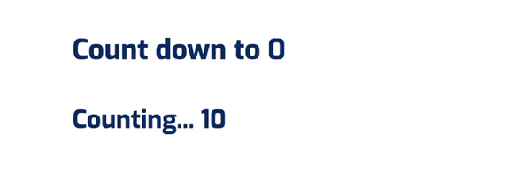

When you talk about a timer, it can be one of the three: *count-down timer*, *count-up timer* or a *stop-watch timer*. Is it possible to create one component that satisfies all cases? Yes, we will explore on how we can create one React component and reuse it to make different timers.

## Component break down

Behind the hood, timer uses counting mechanism. So Let's create a Counter component which will be the core of different Timer components. Our Counter component should be able to -
* accept start, end, step and delay value
* do something when the counter stops
* do something when the counter pauses/resumes
* do something when the counter ends

## Setting the props

We can define the props like this.

```JavaScript
class Counter extends Component {
  static propTypes = {
    start: PropTypes.number.isRequired,
    end: PropTypes.number.isRequired,
    step: PropTypes.number.isRequired,
    delay: PropTypes.number,
    isPause: PropTypes.bool,
  }

  static defaultProps = {
    delay: 1000,
    isPause: false
  }

  state = {
    current: this.props.start
  }

  render () {
    return <>{this.state.current}</>
  }
}
```
I have added an additional prop `isPause` which will be used as a flag for pause/resume state. We need to keep the current value as ther counter runs. Since we cannot mutate the props, we are copying`start` prop  into `current` state. When the counter starts, we will use it record the current counter value.

Btw, if you are wondering what these `<>...</>` are. It is React [Fragment](https://reactjs.org/docs/fragments.html) in short syntax. Make sure you are using React version 16.0 or above to use Fragments.

## Adding functionality

In a real world application, we might want to do something when the counter ends, e.g. showing an alert. As an addition to start/stop methods, we should support calling a function whenever counter changes its status from pause to resume or when it ends.

```JavaScript{7-9}
static propTypes = {
    // ...
    onCounterEnd: PropTypes.func,
    onCounterPause: PropTypes.func,
    onCounterResume: PropTypes.func
}
```

Now let's define the counter start and stop methods.

```JavaScript
startCounter () {
  this.counterId = setInterval(() => {
    const { current } = this.state
    const { end, step } = this.props

    if (current !== end) {
      this.setState({
        current: current + step
      })
    } else {
      this.stopCounter()
    }
  }, this.props.delay)
}

stopCounter () {
  if (this.counterId) {
    clearInterval(this.counterId)
    this.props.onCounterEnd()
  }
}
```

In `startCounter`, we use `setInterval` method to start the counter. We apply the `step` on every `delay` interval until it reaches the `end`. When it reaches the end, we stop the counter by cleaning up the interval using `clearInterval` method. 

Remember, we want to do something on counter ends. We do that by calling `onCounterEnd` prop method inside `stopCounter`. 

## Using component life cycle methods

Previously, we defined the start and stop functions. But component won't do a thing because we haven't setup the actual function calls. For that, we will use React component life cycle methods. 

We want to start the counter as soon as the component is loaded. We can do that by calling `startCounter` in `componentDidMount`.

> `componentDidMount()` is invoked immediately after a component is mounted


```JavaScript
componentDidMount () {
  this.startCounter()
}
```

To cleanup the counter, we can use `componentWillUnmount` method.

> `componentWillUnmount()` is invoked immediately before a component is unmounted and destroyed.

```JavaScript

componentWillUnmount () {
  // cleanup counter
  this.stopCounter()
}
```

Now, the tricky part is handling pause and resume functions. The catch here is we don't need to define new methods. We can reuse `startCounter` and `stopCounter` methods.

Remember we defined `isPause` prop? We will make use of this to handle counter pause/resume state. The logic is simple, if `isPause` is `true`, we stop the counter, otherwise, we start the counter. Now the question is how do we know when `isPause` changes.

Don't worry, we can use another React life cycle method. When `isPause` prop changes, it will trigger an update in component. After the update,`componentDidUpdate` life cycle method is invoked. So we can put a call to `startCounter` and `stopCounter` methods inside `componentDidUpdate`. And don't forget to run the `onCounterPause` and `onCounterResume` prop methods.

```JavaScript
componentDidUpdate (prevProps) {
  if (this.props.isPause !== prevProps.isPause) {
    if (this.props.isPause) {
      this.stopCounter()
      this.props.onCounterPause()
    } else {
      this.startCounter()
      this.props.onCounterResume()
    }
  }
}
```

Since we are using `stopCounter` to pause the counter. We need to know if counter is really stopped in order to call `onCounterEnd` correctly. Again, we can use `isPause` prop to check if counter is paused or not.

```JavaScript{5-7}
stopCounter () {
  if (this.counterId) {
    clearInterval(this.counterId)

    if (!this.props.isPause) {
      this.props.onCounterEnd()
    }
  }
}
```

## Reuse counter by rendering children as a function


<br />

## Let's build a counter first!
### Define the props
First, I want to make generic counter which can count up or down depending on the props. So what are those props? I am guessing, we would need -
* `start`: this would be the initial counter value
* `end`: we need to stop the counter at some point. That would be `end` value. 
When the counting value reaches this value, we will stop the counter.
* `step`: we will use this value to get the next counter value
* `delay`: we will need some delay before calculating the next value. It could be a second, 1 min or whatever we want it to be. We are making this customizable by accepting a prop.

I think it is enough to build the component.

```JavaScript
import React, { Component } from 'react'
import PropTypes from 'prop-types'

class Counter extends Component {
  static propTypes = {
    start: PropTypes.number.isRequired,
    end: PropTypes.number.isRequired,
    step: PropTypes.number.isRequired,
    delay: PropTypes.number
  }

  static defaultProps = {
    delay: 1000 // 1 sec defined in milliseconds
  }

  state = {
    current: this.props.start
  }

  componentDidMount () {
    // This is where we wll start the counter
  }

  componentWillUnmount () {
    // We should cleanup the counter, when the component is about to be unmounted.
  }

  render () {
    return <>{this.state.current}</>
  }
}

export default Counter
```

Btw, if you are wondering what these `<>...</>` are. It is react [Fragment](https://reactjs.org/docs/fragments.html) in short syntax. Make sure you are using react version 16.0 or above to use Fragments.

### Implement counting logic

Okay! We have defined the props. Next, we will add the counting function. We need two functions: one to start counter and another one to clean up the counter because we will be using [setInterval](https://developer.mozilla.org/en-US/docs/Web/API/WindowOrWorkerGlobalScope/setInterval) method.

```JavaScript
startCounter() {
  // setInterval returns an ID which we will save in it counterId variable.
  // We can use that ID to clear the interval, in other words, to stop the counter
  this.counterId = setInterval(() => {
    const { current } = this.state
    const { end, step } = this.props

    if (current !== end) {
      this.setState({
        current: current + step
      })
    } else {
      // when the current value reaches the end, we should stop the counter.
      this.stopCounter()
    }
  }, this.props.delay)
}

// this will put a stop to the counter
stopCounter() {
  if (this.counterId) {
    clearInterval(this.counterId)
  }
}
```

Note that, I am using a class property `counterId` to store the interval ID because we don't need to re-render the component when `counterId` value changes.

Now we should run those methods to make the counter works. I am thinking of starting the counter as soon as the component is loaded. We should also clean up when the component is destroyed. We can do that by using react's life cycle methods: `componentDidMount` and `componentWillUnmount`.

```JavaScript
componentDidMount() {
  this.startCounter()
}

componentWillUnmount() {
  this.stopCounter()
}
```

### Putting it all together

```JavaScript
import React, { Component } from 'react'
import PropTypes from 'prop-types'

class Counter extends Component {
  static propTypes = {
    start: PropTypes.number.isRequired,
    end: PropTypes.number.isRequired,
    step: PropTypes.number.isRequired,
    delay: PropTypes.number
  }

  static defaultProps = {
    delay: 1000 // 1 sec defined in milliseconds
  }

  state = {
    current: this.props.start
  }

  componentDidMount () {
    this.startCounter()
  }

  componentWillUnmount () {
    // cleanup counter
    this.stopCounter()
  }

  startCounter () {
    this.counterId = setInterval(() => {
      const { current } = this.state
      const { end, step } = this.props

      if (current !== end) {
        this.setState({
          current: current + step
        })
      } else {
        this.stopCounter()
      }
    }, this.props.delay)
  }

  stopCounter () {
    if (this.counterId) {
      clearInterval(this.counterId)
    }
  }

  render () {
    return <>{this.state.current}</>
  }
}

export default Counter
```


Here we have a basic counter, which will start counting as soon as the component is loaded. You can set `start, step, end` props and start using like this.

```JavaScript{5}
import React from 'react'
import Counter from './Counter'

const CountDown = () => (
  <div>
    <h3>Count down to 0</h3>
    <h4>
      Counting... <Counter start={10} step={-1} end={0} />
    </h4>
  </div>
)

export default CountDown
```
⬇️ ⬇️ ⬇️ ️



### More functions!

According to the agenda, we still have two requirements to work on.
* pause/resume counter
* do something when the counter ends

#### Pause/resume

To support this, we need to introduce a new prop called `isPause` which will let us know when to pause or restart the timer.

```JavaScript{7,12}
class Counter extends Component {
  static propTypes = {
    start: PropTypes.number.isRequired,
    end: PropTypes.number.isRequired,
    step: PropTypes.number.isRequired,
    delay: PropTypes.number,
    isPause: PropTypes.bool,
  }

  static defaultProps = {
    delay: 1000, // 1 sec defined in milliseconds
    isPause: false
  }
```

The next question is where do we implement this pause/resume logic. No worries,  we can use `componentDidUpdate` react life cycle method, which is called every time the component is updated. When the props change, the component will update and `componentDidUpdate` will be called. So we can write our logic there. One thing to note, if you are updating component state inside `componentDidUpdate`, you should only do that inside some condition. Otherwise, your component will keep updating itself forever... 😱

```JavaScript
componentDidUpdate(prevProps) {
  // We need to check if isPause has a different value
  if (this.props.isPause !== prevProps.isPause) {
    if (this.props.isPause) {
      this.stopCounter()
    } else {
      this.startCounter()
    }
  }
}
```

While we are on this, why don't we implement the next requirements.
Let's update the props first.
```JavaScript{8-10,16-18}
class Counter extends Component {
  static propTypes = {
    start: PropTypes.number.isRequired,
    end: PropTypes.number.isRequired,
    step: PropTypes.number.isRequired,
    delay: PropTypes.number,
    isPause: PropTypes.bool,
    onCounterEnd: PropTypes.func,
    onCounterPause: PropTypes.func,
    onCounterResume: PropTypes.func
  }

  static defaultProps = {
    delay: 1000,
    isPause: false,
    onCounterEnd: () => {},
    onCounterPause: () => {},
    onCounterResume: () => {}
  }
```

```JavaScript{5,8,17-19}
componentDidUpdate(prevProps) {
  if (this.props.isPause !== prevProps.isPause) {
    if (this.props.isPause) {
      this.stopCounter()
      this.props.onCounterPause()
    } else {
      this.startCounter()
      this.props.onCounterResume()
    }
  }
}

stopCounter() {
  if (this.counterId) {
    clearInterval(this.counterId)

    if (!this.props.isPause) {
      this.props.onCounterEnd()
    }
  }
}
```


```JavaScript{20-23}
import React, { useState} from 'react'
import Counter from './Counter'

const CountDown = () => {
  const [isPause, pauseCounter] = useState(false)
  const [status, updateStatus] = useState('running')

  return (
    <div>
      <h3>Count down to 0</h3>
      <button onClick={() => pauseCounter(!isPause)}>
        {isPause ? 'play' : 'pause'}
      </button>
      <h4>
        Counting...{' '}
        <Counter
          start={10}
          step={-1}
          end={0}
          isPause={isPause}
          onCounterPause={() => updateStatus('paused')}
          onCounterResume={() => updateStatus('running')}
          onCounterEnd={() => updateStatus('stopped')}
        />
      </h4>
      <p>Counter status: {status}</p>
    </div>
  )
}

export default CountDown
```
<br />

## Moving on to making a timer
