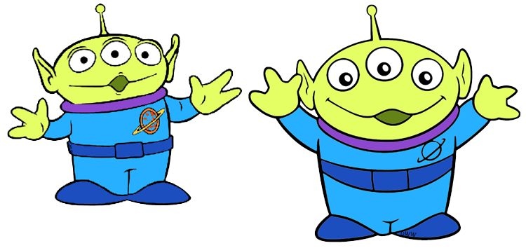
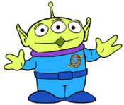

A picture is worth a thousand words. At work, I communicate directly with designers and product owner. Sometimes it makes more sense to show a picture than explaining all in and outs of an UI part in words. 

When I need to show a before & after comparison of an UI element, I would take some screenshots and upload them in slack for feedbacks. However, when the difference is subtle, it is more suited to show a side by side comparison in one picture. In those times, imagemagick is my savior, I could quickly stitch screenshots within seconds in the terminal and pass the resulting image to whoever needed to see.

For those who don't know what imagemagick is, it's a very powerful command line application for image manipulation and processing. It is open-source and runs on major operating systems including Android and iOS and others. You can learn more about it [here](https://imagemagick.org).

Here I will share simple and useful imagemagick tricks that you can use at your work or in projects. 

Let's try out imagemagick tricks with our alien friends from Toy Story.


> Credit to images from [Disneyclips](https://www.disneyclips.com/images/toystory.html)

## Installing

You can install `imagemagick` by following the [instructions](https://imagemagick.org/script/download.php) on their official website.

If you are on Mac, you can quickly install with either *MacPorts* for *Homebrew*.

```shell
# installing with MacPorts
sudo port install imagemagick

# installing with Homebrew
brew install imagemagick
```


## Converting image format

```shell
# convert jpg to png
magick alien.jpg alien.png

#convert png to jpg
magick alien.png alien.jpg
```

## Resizing images

Before resizing an image, you might want to find out the current dimension. You can do that by using `identify` command.

```shell
magick identify alien.png
# alien.png PNG 350x298 350x298+0+0 8-bit sRGB 53863B 0.010u 0:00.002
```

If you want more details, you can go `verbose` on the above command.
```shell
magick identify -verbose alien.png
```

You will see a detailed output like below.
```
Image: alien.png
  Format: PNG (Portable Network Graphics)
  Mime type: image/png
  Class: DirectClass
  Geometry: 350x298+0+0
  Resolution: 28.35x28.35
  Print size: 12.3457x10.5115
  Units: PixelsPerCentimeter
  Colorspace: sRGB
  Type: TrueColorAlpha
```

Now we can see that `alien.png` has a dimension of 350x298 pixels. How about we resize it down to half of its current size, which is 175x149 px. In this case, you can use `convert` command-line utility. You can either call it by `magick convert` or just `magick` since it is linked to magick utility.

```shell
magick convert alien.png -resize 175x149 alien-50.png
# same
magick alien.png -resize 175x149 alien-50.png
```

Note that alien-50.png is the resulting image.

You can also use percentage value when resizing the image.

```shell
magick alien.png -resize 50% alien-50.png
```
OK, it should be resize to 175x146 px. Let's find out using `identify`.

```shell
magick identify alien-50.png
# alien-50.png PNG 175x149 175x149+0+0 8-bit sRGB 28130B 0.000u 0:00.000
```



## Stitching images

Merge A and B horizontally as C
```shell
magick convert +append a.png b.png c.png
```

Merge A and B vertically as C 
```shell
magick convert -append a.png b.png c.png
```


## Cropping image
```shell
convert bg-img.jpg -gravity Center -crop 1440x400+0+0 crop_center_2.jpg
```


